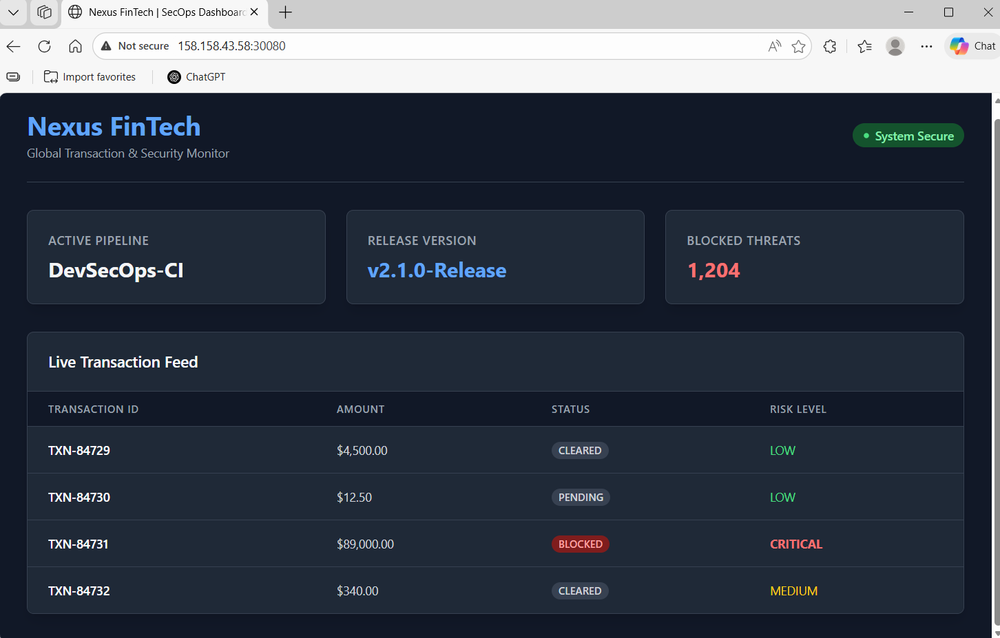
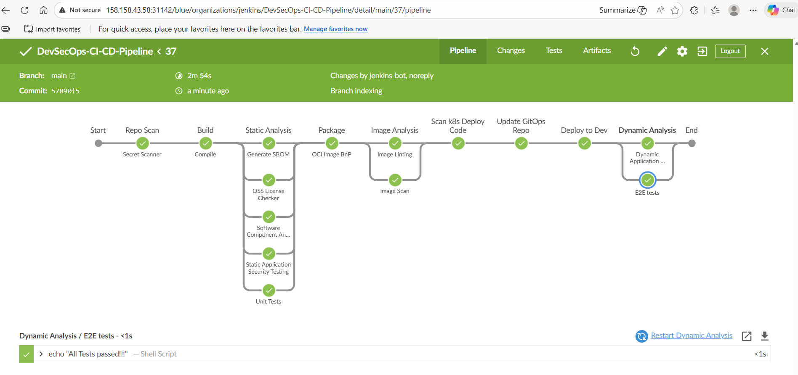
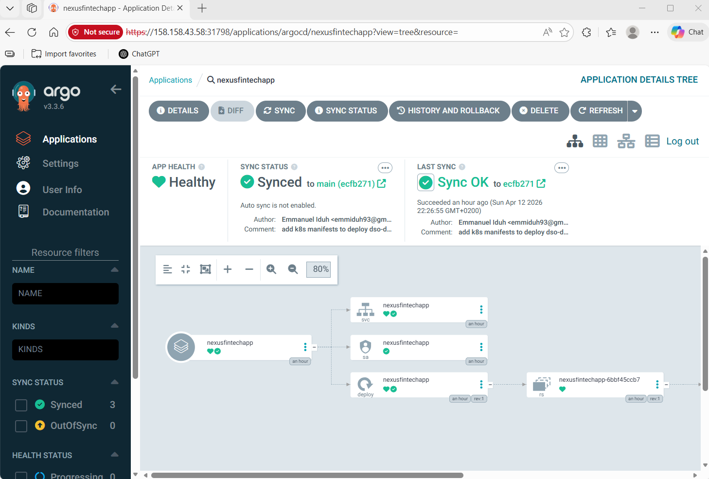

# Nexus FinTech: DevSecOps CI/CD Pipeline on Kubernetes with Jenkins, Helm, and ArgoCD

## Overview

This repository houses **Nexus FinTech**, an API-driven financial security dashboard, and the comprehensive **DevSecOps workflow** built to secure and deploy it. 
Running on top of a Kubernetes cluster, this project demonstrates a modern, automated Continuous Integration (CI) and Continuous Delivery (CD) lifecycle. It integrates rigorous security scanning at every stage of the pipeline—from source code to live deployment—using Jenkins, ArgoCD, and industry-standard open-source security tools.
*Note: This project is a heavily refactored hard fork, transitioning from a basic server-side rendered application to a multi-tier API architecture with a Tailwind CSS frontend.*

## Key Features

### The Application (Nexus FinTech)
- **Backend:** Java Spring Boot REST API providing live mock transaction streams and system health data.
- **Frontend:** Responsive, dark-mode dashboard built with HTML, Vanilla JavaScript, and Tailwind CSS.
- **Containerized:** Packaged into an optimized OCI-compliant image using multi-stage builds.
  
### Kubernetes & Infrastructure
- Provisioned on a Kubernetes cluster with secure local `kubectl` access.
- Infrastructure and CI/CD tooling managed via **Helm**.
- Local path provisioning for persistent volumes.

### Jenkins CI/CD Pipeline
- **Pipeline as Code:** Orchestrated via a highly structured, declarative `Jenkinsfile`.
- **Ephemeral Build Agents:** Jenkins dynamically spins up isolated Kubernetes Pods (defined in `build-agent.yaml`) for each build stage.
- **Daemonless Building:** Uses **Kaniko** for secure container image building and publishing inside Kubernetes without exposing the Docker daemon.

### Jenkins setup

- Setup Jenkins server

  ```s
  helm repo add jenkins https://charts.jenkins.io
  helm repo update
  helm install jenkins jenkins/jenkins
  ```

- Wait for the jenkins pod to start
- Get admin user password of Jenkins

  ```s
    kubectl exec --namespace default -it svc/jenkins -c jenkins -- /bin/cat /run/secrets/chart-admin-password && echo
  ```

  **Note:** Make a note of the password

- Add additonal plugins to Jeninks server (Manage Jenkins -> Manage plugins)

  - BlueOcean
  - Configuration as Code
  - OWASP Dependency-Track

### Dependency Track setup

- Refer [Dependency Track v4 Installation Guide](DEPENDENCY_TRACK.md)

  **Note:** dependency-track will take some time to start (~1hr on low end Mac)

### Link Jenkins and Dependency Track

- Login to Dependency track -> Administration -> Access Management -> Teams -> Click on Automation -> Copy the API Keys -> Also add the Permissions - PROJECT_CREATION_UPLOAD, POLICY_VIOLATION_ANALYSIS, VULNERABILITY_ANALYSIS

- Login to Jenkins -> Manage Jenkins -> Configure System -> Scroll to bottom -> Configure the Dependency-Track URL and API key -> Also enable Auto Create Projects -> Test Connection -> Save

Hint: URL (if you have followed the exact steps) http://dependency-track-apiserver.dependency-track.svc.cluster.local

### Security Integration(The "Sec" in DevSecOps)
- **SAST (Static Application Security Testing):** Code analysis using ShiftLeft.
- **Secret Scanning:** TruffleHog integration to prevent hardcoded passwords or API keys.
- **SCA (Software Component Analysis):** OWASP Dependency-Check to scan open-source libraries for known vulnerabilities.
- **SBOM Generation:** CycloneDX generates a Software Bill of Materials, published to a Dependency-Track server.
- **License Compliance:** OSS License Finder ensures third-party dependencies meet legal requirements.
- **Image Linting & Scanning:** Dockle for best-practice linting and Trivy for deep container vulnerability scanning.
- **Manifest Scanning:** Kubesec analyzes Kubernetes deployment YAMLs for misconfigurations.
- **DAST (Dynamic Application Security Testing):** OWASP ZAP automatically attacks the deployed Dev environment to find runtime vulnerabilities.

### Container Image Hardening
- Used **Dockle** to lint container images for security best practices.
- Scanned images with **Trivy** to identify known vulnerabilities.
- Optimized Dockerfile using **multi-stage builds**.
- Added non-root user and health checks for secure container practices.

### Continuous Deployment (GitOps)
- Installed and configured **ArgoCD** for GitOps-based deployments.
- Set up **CLI access and RBAC** to manage and secure ArgoCD.
- Configured Jenkins to **trigger ArgoCD deployments** automatically after successful builds.
- Deployed applications to Kubernetes using **generated manifests**.

## Tools & Technologies

| Category           | Tools / Platforms                                    |
|--------------------|------------------------------------------------------|
| Cloud              | Google Cloud Platform (GKE), Azure, AWS              |
| CI/CD              | Jenkins, Jenkinsfile, Kaniko                         |
| GitOps/CD          | ArgoCD                                               |
| Kubernetes         | K8s, Helm, kubectl                                   |
| Security (App)     | ShiftLeft (SAST), OWASP ZAP (DAST), TruffleHog       |
| Security (Dep)     | OWASP Dependency-Check, CycloneDX, Dependency-Track 	|
| Security (Inf)     | Trivy, Dockle, Kubesec                   				    |
| Programming        | Java (Spring Boot), JavaScript, Tailwind CSS         |
| Containerization   | Docker, Dockerfile (multi-stage)                     |


## 📸 Project Visuals

##### Nexus FinTech Dashboard (Live App)


##### CI/CD Pipeline View (Blue Ocean)


##### ArgCD Dashboard


##### Dependency Track


